# Greenery Analytics

Greenery Analytics เป็น end-to-end batch data pipeline ที่สร้างขึ้นบน dataset ของ e-commerce (Greenery) โดยครอบคลุม lifecycle ของงาน Data Engineering ตั้งแต่ต้นจนจบ — ตั้งแต่การดึงข้อมูลดิบจาก PostgreSQL, แปลงข้อมูลด้วย PySpark, จัดเก็บใน GCS และ BigQuery ไปจนถึง dbt models ที่แบ่ง layer ชัดเจนทั้ง staging, intermediate และ mart — เพื่อรองรับการวิเคราะห์พฤติกรรมลูกค้าและ e-commerce funnel

---

## Architecture

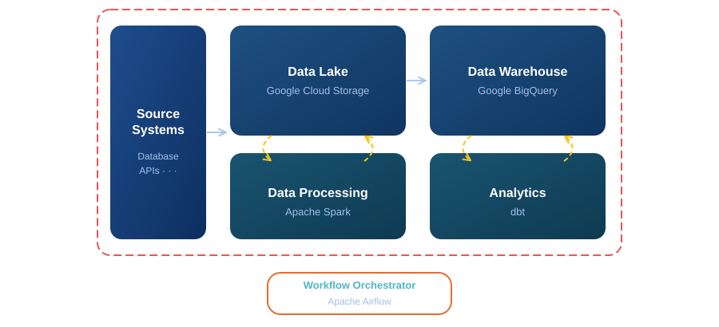

มี Airflow DAG แยกกัน 7 ตัว — หนึ่งตัวต่อหนึ่ง entity (`orders`, `users`, `products`, `events`, `promos`, `addresses`, `order_items`) แต่ละตัวรัน daily และทำงานตาม pattern เดียวกัน:

1. **Extract** — ดึงข้อมูลแบบจาก PostgreSQL แล้ว upload ขึ้น GCS เป็น CSV (prefix: `raw/`)
2. **Transform** — ส่ง PySpark job ไปรันบน Spark cluster อ่าน CSV มา enforce schema + cleanup แล้ว write กลับเป็น Parquet (prefix: `cleaned/`)
3. **Load** — load Parquet จาก GCS เข้า BigQuery แบบ time-partitioned table
4. **Model** — `greenery_dbt_dag` (ใช้ Astronomer Cosmos) รับช่วงต่อจาก BigQuery แล้วรัน dbt models ทั้งหมด

> **Screenshot:** *(Airflow DAG grid view แสดง pipeline ทั้งหมด)*

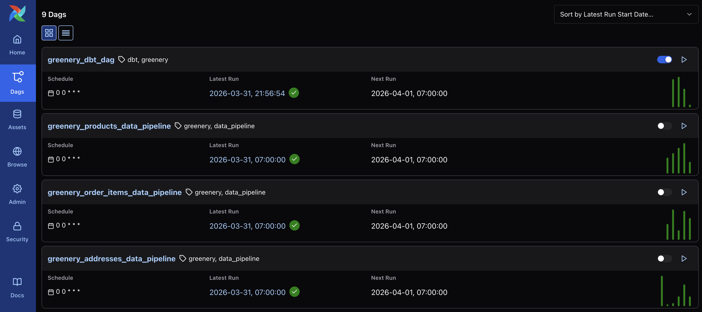
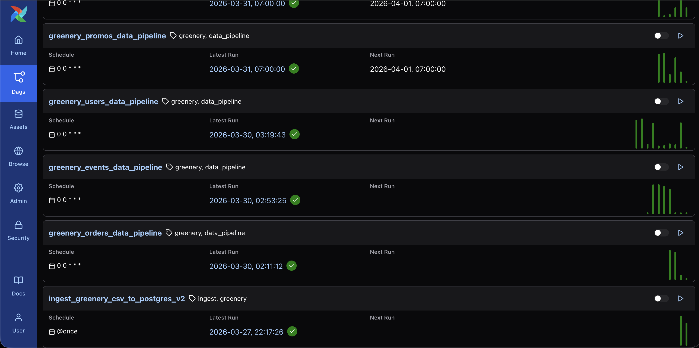

> **Screenshot:** *(DAG graph view task flow: branch → spark → BQ)*

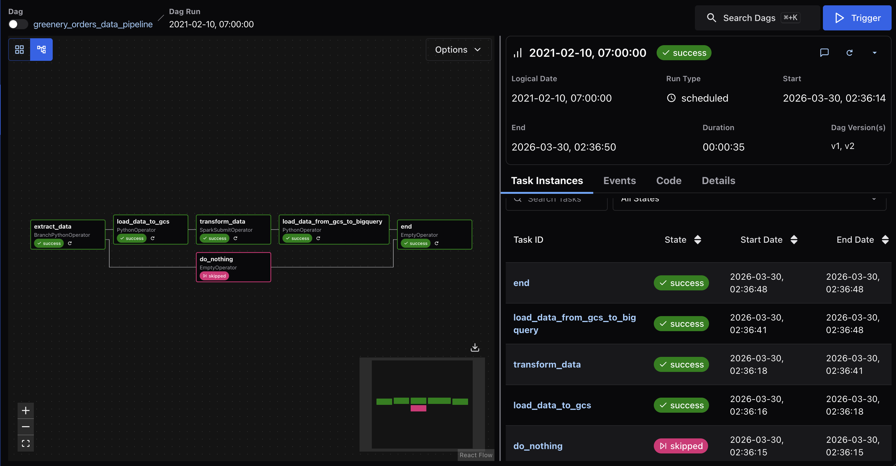
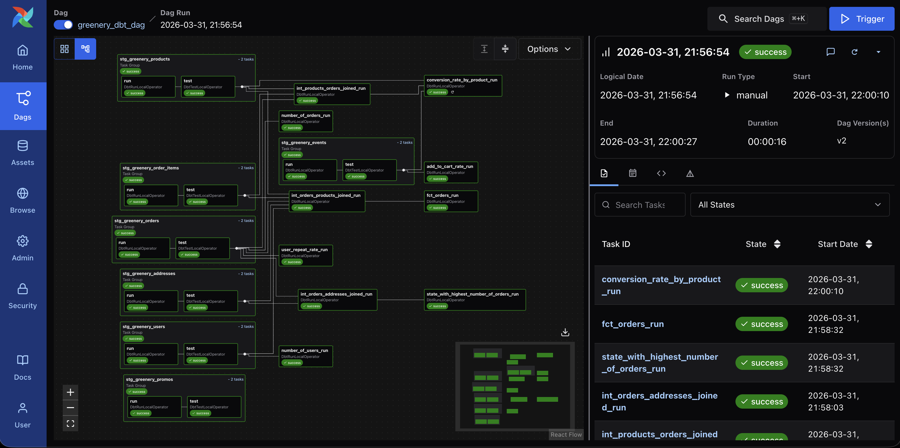

---

## dbt Layers

```
staging/        → rename columns, cast types, deduplicate
intermediate/   → join ข้ามตาราง (orders × products, orders × addresses)
marts/          → final models สำหรับตอบ business questions
```

mart layer สร้างมาเพื่อตอบคำถามเหล่านี้:

| Mart Model | Business Question |
|---|---|
| `number_of_users` | มี user ทั้งหมดกี่คน? |
| `number_of_orders` | มี order ทั้งหมดกี่ order? |
| `state_with_highest_number_of_orders` | รัฐไหนมี order เยอะที่สุด? |
| `user_repeat_rate` | มีกี่ % ของ user ที่กลับมาซื้อซ้ำ? |
| `add_to_cart_rate` | อัตราการ add-to-cart จาก page view เป็นเท่าไร? |
| `conversion_rate_by_product` | conversion rate ของแต่ละสินค้าเป็นเท่าไร? |
| `fct_orders` | Fact table แบบ denormalized (รวม user + product + address) |

> **Screenshot:** *(dbt lineage graph DAG ทั้งหมดตั้งแต่ source → staging → intermediate → marts)*

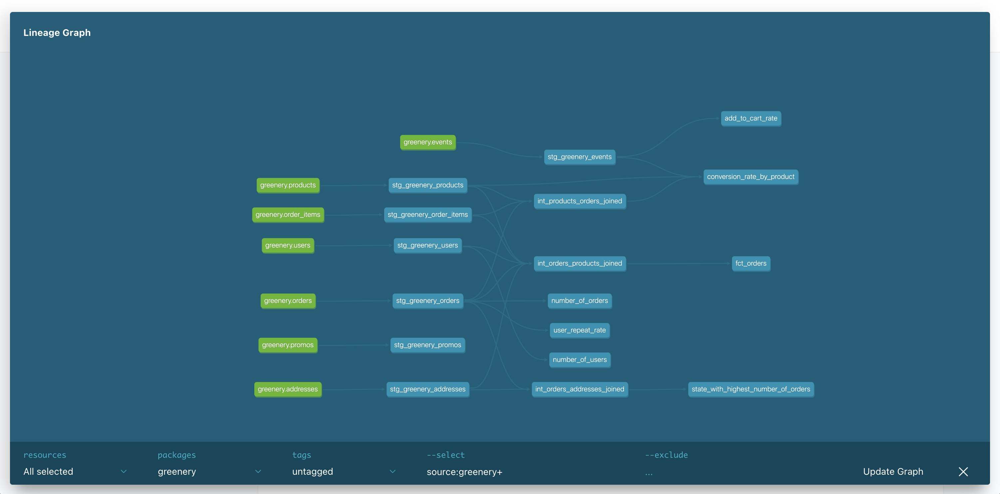

> **Screenshot:** *(BigQuery console แสดง dataset กับ tables ทั้งหมด และ query result ของ mart models)*

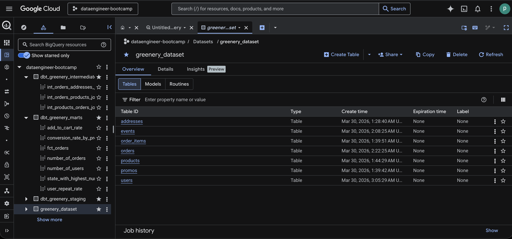
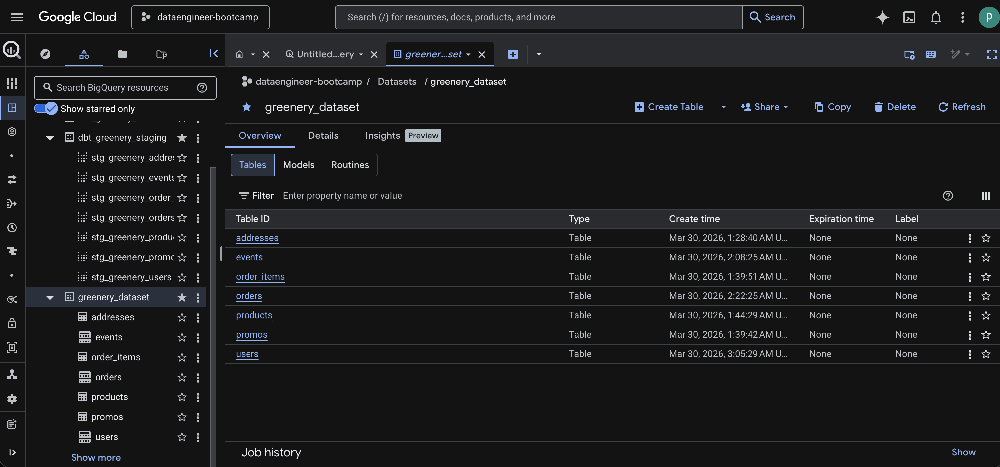
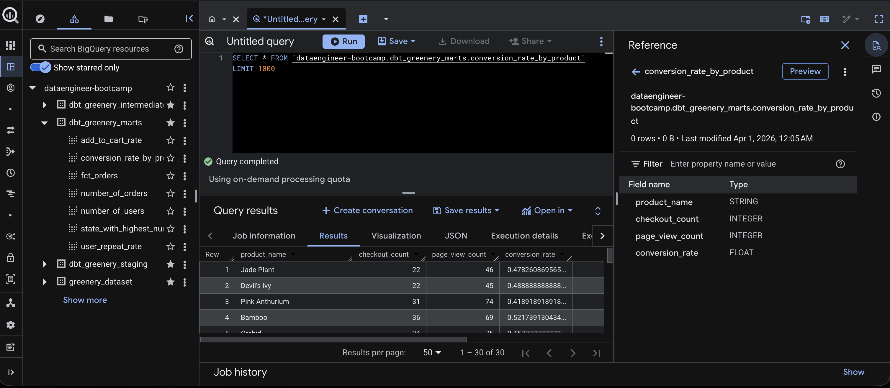
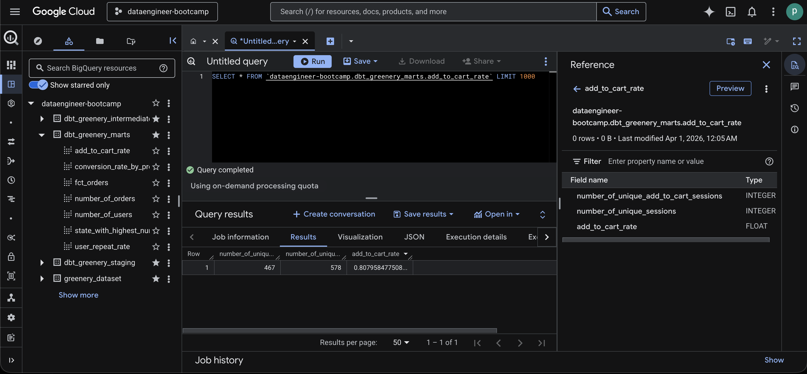
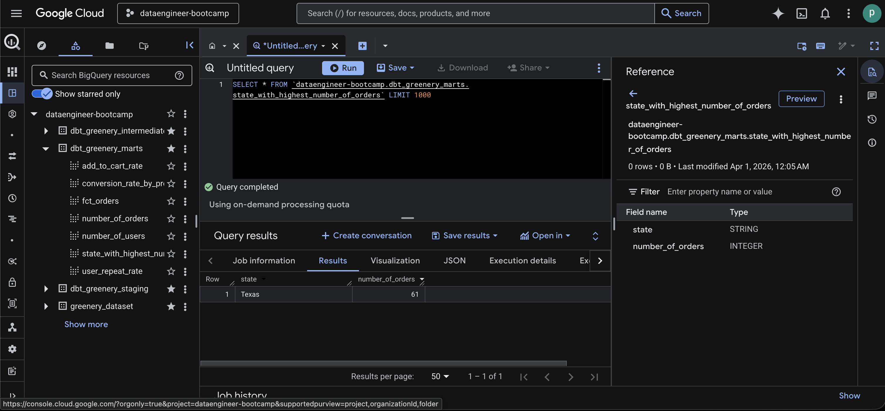
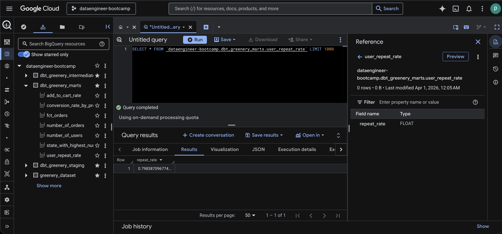
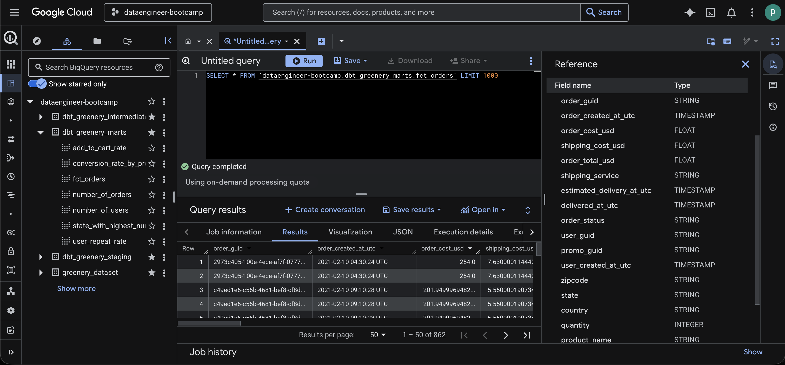

---

## Tech Stack

- **Orchestration** — Apache Airflow
- **Processing** — Apache Spark / PySpark
- **Transformation** — dbt Core + BigQuery adapter
- **Storage** — Google Cloud Storage, Google BigQuery
- **Source DB** — PostgreSQL
- **Infra** — Docker Compose (Airflow + Spark cluster + PostgreSQL)

---

## Project structure

```
greenery-analytics/
├── dags/               # Airflow DAGs (7 entity pipelines + dbt DAG)
├── dbt/greenery/
│   └── models/
│       ├── staging/      # 7 staging models
│       ├── intermediate/ # 3 join models
│       └── marts/        # 7 business metric models
├── pyspark/            # PySpark transformation jobs (แยกตาม entity)
├── docker/             # Dockerfiles สำหรับ Airflow และ Spark
├── dataset/greenery/   # Seed SQL scripts สำหรับ source PostgreSQL
├── docker-compose.yml
└── Makefile
```

---

## Local

**ต้องมี:** Docker และ GCP Service Account ที่มีสิทธิ์ BigQuery + GCS

```bash
# start ทุก service (Airflow, Spark cluster, PostgreSQL)
make build
make up
```

Airflow UI: `http://localhost:8080`  

**ตั้งค่า Airflow Connections** (Admin → Connections):

| Conn ID | Type | รายละเอียด |
|---|---|---|
| `postgres_source` | Postgres | Host: `source_postgres`, Port: `5432`, Database: `greenery`, Login: `postgres`, Password: `postgres` |
| `my_spark` | Spark | Host: `spark://spark-master`, Port: `7077` |
| `load_data_to_gcs` | Google Cloud Platform | Project ID: `<your_project_id>`, Keyfile JSON: `<your_service_account_json>` |
| `load_data_from_gcs_to_bigquery` | Google Cloud Platform | Project ID: `<your_project_id>`, Keyfile JSON: `<your_service_account_json>` |

**Trigger DAGs :**

1. `ingest_data_to_postgres` — seed ข้อมูลเข้า source database
2. `greenery_*_data_pipeline` — รัน pipeline extract → spark → BQ ของแต่ละ entity
3. `greenery_dbt_dag` — รัน dbt models ทั้งหมดบน BigQuery

```bash
# รัน dbt แยก (ต้องมี BigQuery credentials)
cd dbt/greenery
dbt run
dbt test
```

```bash
# shortcut ต่าง ๆ ของ Spark (ผ่าน Makefile)
make bash       # เข้า shell ใน spark-master
make pyspark    # เปิด PySpark REPL
make notebook   # Jupyter notebook ที่ port 3000
```


